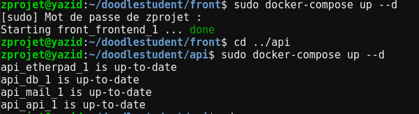

### Documentation projet - Aouad Yazid

## Dockerfile et docker-compose.yml pour la Tâche 1

### Dockerfile pour la partie backend (dans `doodlestudent/api`)

Le Dockerfile situé dans le répertoire doodlestudent/api est utilisé pour construire une image Docker du service backend de l'application. Il commence par utiliser l'image Maven comme base pour la construction, puis copie les fichiers sources du projet dans le répertoire de travail. Ensuite, il exécute la commande Maven pour construire l'application Quarkus, et expose le port 9090 sur lequel l'application sera accessible.

### Dockerfile pour la partie frontend (dans `doodlestudent/front`)

Le Dockerfile situé dans le répertoire doodlestudent/front est utilisé pour construire une image Docker du service frontend de l'application. Il commence par utiliser l'image officielle Node.js comme base pour la construction. Ensuite, il copie tous les fichiers du projet dans le répertoire de travail, installe les dépendances nécessaires avec npm install, construit l'application Angular en mode production avec npm run build, puis utilise l'image NGINX pour servir l'application construite. Enfin, il expose le port 80 sur lequel l'application sera accessible.

### docker-compose.yml

Le docker-compose.yml est utilisé pour orchestrer le déploiement de l'application et de ses dépendances. Il définit plusieurs services, y compris une base de données MySQL, Etherpad, un serveur SMTP, ainsi que les services backend et frontend. Chaque service est configuré avec les options nécessaires, telles que les variables d'environnement pour la configuration de la base de données et du serveur SMTP, ainsi que les dépendances entre les différents services. Ce fichier permet de facilement déployer et configurer l'ensemble de l'application en utilisant Docker et Docker Compose.

## Configuration de la Gateway d'API avec NGINX - Tâche 2 

Dans cette partie, j'ai configuré la gateway d'API en utilisant NGINX pour router les requêtes vers les différents services backend en fonction de l'URI. Pour ce faire, j'ai créé trois fichiers de configuration nginx (nginx1.conf, nginx2.conf, nginx3.conf) dans le répertoire /api/nginxConf. Chaque fichier de configuration définit un server block pour un service spécifique, en écoutant sur le port 80 et en utilisant le nom de domaine correspondant (myadmin.tlc.fr, doodle.tlc.fr, pad.tlc.fr). Les configurations nginx utilisent des directives location pour définir les chemins d'accès et les règles de routage vers les services backend appropriés. De plus, j'ai ajouté les entrées correspondantes dans le fichier /etc/hosts pour mapper les noms de domaine aux adresses IP du serveur. Cela permet de rediriger les requêtes des utilisateurs vers les bons services backend en fonction de l'URI demandée.

## Tâche 3

## Tâche 4 - Documentation du Déploiement
 

cette image montre deux conteneurs Docker, un pour le service frontend (`front_frontend_1`) et un pour le service backend (`api_etherpad_1`, `api_db_1`, `api_mail_1`, `api_api_1`). Les conteneurs du service backend sont liés à différents services, y compris Etherpad, la base de données, et le serveur SMTP. Les services frontend et backend sont démarrés et fonctionnels sur la machine virtuelle.

## Aventure - Déploiement avec microK8S

Le déploiement de la partie back de l'application repose sur l'utilisation de microK8S pour orchestrer les conteneurs Docker. Voici comment fonctionne le déploiement :

### Fichier deployement-back.yaml

Ce fichier définit un déploiement pour les services backend de l'application. Il spécifie les réplicas, les images des conteneurs, et les ports exposés pour chaque service. Plus précisément :
- Le service API est déployé avec l'image `localhost:32000/api:latest` et expose le port 80.
- Le service Etherpad est déployé avec l'image `localhost:32000/etherpad:latest` et expose le port 9001.
- Le service MySQL est déployé avec l'image `localhost:32000/mysql:latest` et expose le port 3306.
Chaque conteneur est configuré avec des arguments spécifiques, notamment pour les paramètres de connexion à la base de données MySQL et les paramètres de configuration de l'API.

### Fichier namespace.yaml

Ce fichier crée un espace de noms isolé appelé `doodle-back` pour héberger les services backend. Cela permet d'isoler ces services du reste de l'infrastructure et de garantir une meilleure gestion et organisation des ressources.

### Fichier service-back.yaml

Ce fichier définit un service pour les services backend dans l'espace de noms `doodle-back`. Il permet la communication entre les différents conteneurs en exposant les ports nécessaires. Plus précisément :
- Le service API expose le port 80.
- Le service Etherpad expose le port 9001.
- Le service MySQL expose le port 3306.
- Un service SMTP est également exposé sur le port 25 pour la communication SMTP.
 
